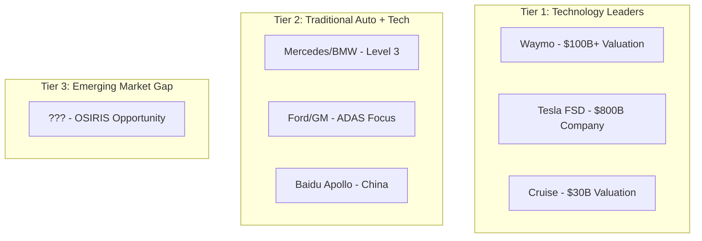

# **PROJECT OSIRIS - Competitive Intelligence Report**

**Classification:** UNCLASSIFIED - PUBLIC  
**Version:** 1.0  
**Date:** July 2025  
**Status:** Draft - Community Review

---

## **Executive Summary**

The autonomous vehicle market exhibits a critical blind spot: **zero major players have functional solutions for emerging market chaotic traffic**. While $127B is invested globally in AV development, the $32B emerging market segment remains completely unserved due to technical and cultural barriers.

**Key Finding**: OSIRIS enters a market with established giants but **zero direct competition** in our target segment.

---

## **Market Landscape Overview**

### **Global AV Market Structure**


### **Technology Deployment Map**
| Company | Western Markets | China | Emerging Markets |
|---------|----------------|--------|------------------|
| Waymo | ✅ Advanced | ❌ Blocked | ❌ No presence |
| Tesla | ✅ Advanced | ✅ Growing | ❌ No adaptation |
| Cruise | ✅ Limited | ❌ No presence | ❌ No presence |
| Baidu | ❌ No presence | ✅ Advanced | ❌ No presence |
| **OSIRIS** | 🎯 Future | 🎯 Future | ✅ **First mover** |

---

## **Tier 1 Competitors Analysis**

### **Waymo (Alphabet)**
**Strengths:**
- 20+ billion miles simulation experience
- $100B+ parent company resources
- Advanced sensor fusion technology
- Proven robotaxi operations (Phoenix, SF)

**Weaknesses in Our Market:**
- Zero understanding of informal traffic patterns
- Requires perfect infrastructure (lane markings, signage)
- Data center-scale computational requirements
- No cultural adaptation framework

**Lagos Deployment Probability:** <5% by 2030
```python
# What Waymo sees in Lagos traffic
waymo_perception = {
    "okada": "unclassified_object",
    "go_slow": "undefined_traffic_state", 
    "street_vendor": "unexpected_pedestrian",
    "danfo_loading": "vehicle_malfunction"
}
```

**Competitive Response Timeline:**
- **Years 1-2**: Ignore emerging markets
- **Years 3-4**: Explore partnerships
- **Years 5+**: Attempt direct entry (too late)

### **Tesla Full Self-Driving**
**Strengths:**
- Massive real-world data collection (millions of vehicles)
- Neural network end-to-end approach
- Rapid iteration cycles
- Strong brand recognition

**Weaknesses in Our Market:**
- Western-centric training data
- Assumes formal road infrastructure
- No multi-modal transport understanding
- Limited edge computing optimization

**Lagos Deployment Probability:** 15% by 2030
```python
# Tesla's challenge with Lagos
tesla_training_data = {
    "total_miles": "billions",
    "african_roads": "~0%",
    "okada_interactions": "0 examples",
    "informal_infrastructure": "not_in_dataset"
}
```

**Competitive Threat Level:** Medium (could adapt faster than others)

### **Cruise (GM)**
**Strengths:**
- Strong backing from GM
- Focus on urban environments
- Robotaxi operational experience
- Safety-first approach

**Weaknesses in Our Market:**
- Geofenced to mapped areas only
- Requires HD maps (unavailable in Lagos)
- Conservative deployment strategy
- Limited international experience

**Lagos Deployment Probability:** <5% by 2030

**Competitive Threat Level:** Low (too conservative for chaotic markets)

---

## **Tier 2 Competitors Analysis**

### **Baidu Apollo (China)**
**Strengths:**
- Experience with chaotic Chinese traffic
- Government backing and data access
- Open platform approach
- Understanding of dense urban environments

**Weaknesses in Our Market:**
- China-specific cultural adaptations
- Limited international deployment
- Different traffic chaos patterns
- Language/cultural barriers in Africa

**Lagos Deployment Probability:** 25% by 2030

**Competitive Threat Level:** High (most likely to attempt similar approach)

### **Traditional Automakers (Mercedes, BMW, Ford)**
**Strengths:**
- Manufacturing and deployment scale
- ADAS integration experience
- Global market presence
- Regulatory relationships

**Weaknesses in Our Market:**
- Level 2/3 ADAS focus, not full autonomy
- Risk-averse corporate culture
- Limited AI/ML innovation
- Western market priorities

**Lagos Deployment Probability:** 10% by 2030

**Competitive Threat Level:** Low (partnership opportunity)

---

## **Startup Landscape**

### **Potential Emerging Competitors**

**African AV Startups:**
- **Current Status**: None with significant funding or technology
- **Barrier to Entry**: Lack of AI expertise and capital
- **Timeline**: 3-5 years to reach competitive capability

**Global AV Startups Expanding:**
- **Pony.ai**: China-focused, unlikely African expansion
- **Aurora**: Trucking focus, different market segment  
- **Argo AI**: Shut down (Ford/VW withdrew)

**Synthetic Data Competitors:**
- **Applied Intuition**: High-end simulation, Western traffic only
- **NVIDIA Omniverse**: Platform, not solution
- **AImotive**: Traditional approach, no cultural focus

---

## **Technology Gap Analysis**

### **Critical Capabilities Missing in Market**

| Capability | Waymo | Tesla | Cruise | Baidu | OSIRIS |
|------------|-------|-------|--------|-------|--------|
| Lagos Traffic Understanding | ❌ | ❌ | ❌ | ❌ | ✅ |
| Cultural Behavior Prediction | ❌ | ❌ | ❌ | ❌ | ✅ |
| Multi-Modal Transport | ❌ | ❌ | ❌ | ❌ | ✅ |
| Edge Computing Deployment | ❌ | ✅ | ❌ | ✅ | ✅ |
| Resource Efficiency | ❌ | ❌ | ❌ | ❌ | ✅ |
| Informal Infrastructure | ❌ | ❌ | ❌ | ❌ | ✅ |

### **Synthetic Data Generation Landscape**

```python
# Competitive positioning
synthetic_data_market = {
    "applied_intuition": {
        "cost_per_scenario": "$100+",
        "cultural_accuracy": "<10%",
        "deployment": "cloud_only"
    },
    "nvidia_drive_sim": {
        "cost_per_scenario": "$50+", 
        "cultural_accuracy": "<5%",
        "deployment": "data_center"
    },
    "osiris_mirage": {
        "cost_per_scenario": "$0.10",
        "cultural_accuracy": ">90%", 
        "deployment": "edge_capable"
    }
}
```

---

## **Patent Landscape Analysis**

### **Key Patent Holders**
- **Waymo**: 1,500+ autonomous driving patents
- **Tesla**: 300+ FSD-related patents
- **Cruise**: 200+ urban driving patents
- **Baidu**: 400+ China-focused patents

### **Patent Gap Areas (OSIRIS Opportunities)**
1. **Cultural traffic pattern recognition** (zero existing patents)
2. **Multi-modal transport AI** (limited prior art)
3. **Resource-efficient synthetic data generation** (emerging area)
4. **Informal infrastructure navigation** (unpatented space)

### **Defensive Patent Strategy**
```yaml
osiris_patent_roadmap:
  phase_1:
    - "Cultural traffic behavior modeling"
    - "Lightweight synthetic data generation"
    - "Multi-modal transport prediction"
  
  phase_2:
    - "Real-time cultural adaptation algorithms"
    - "Edge-optimized autonomous decision making"
    - "Informal infrastructure navigation systems"
```

---

## **Competitive Response Scenarios**

### **Scenario 1: Big Tech Acquisition Attempt**
**Probability**: 40%  
**Timeline**: 18-24 months after initial success  
**Response Strategy**: 
- Build strong IP portfolio
- Establish customer lock-in
- Create cultural expertise moat

### **Scenario 2: Direct Competition Development**
**Probability**: 30%  
**Timeline**: 3-4 years  
**Response Strategy**:
- First-mover advantage exploitation
- Local partnership network
- Continuous cultural learning

### **Scenario 3: Partnership Offers**
**Probability**: 60%  
**Timeline**: 12-18 months  
**Response Strategy**:
- Selective partnerships that accelerate growth
- Maintain technology independence
- Focus on complementary relationships

### **Scenario 4: Market Ignoring**
**Probability**: 50%  
**Timeline**: Ongoing  
**Response Strategy**:
- Continue building market presence
- Demonstrate ROI to attract attention
- Prepare for eventual competitive entry

---

## **Competitive Advantages Analysis**

### **Sustainable Competitive Moats**

**1. Cultural Knowledge Moat**
- Impossible to replicate without local presence
- Requires years of cultural immersion
- Network effects with local experts

**2. Resource Efficiency Moat**  
- 10x cost advantage compounds over time
- Enables broader market access
- Creates pricing pressure on competitors

**3. First-Mover Moat**
- Customer relationships and data access
- Regulatory relationships
- Market education investment

**4. Technical Architecture Moat**
- Purpose-built for emerging markets
- Not easily adapted from Western solutions
- Continuous improvement feedback loop

### **Competitive Vulnerability Assessment**

| Threat Vector | Risk Level | Mitigation Strategy |
|---------------|------------|-------------------|
| Big Tech resources | High | Speed and agility advantage |
| Patent warfare | Medium | Defensive patent portfolio |
| Customer poaching | Medium | Strong relationships, switching costs |
| Technology copying | Low | Cultural moat protection |

---

## **Market Entry Barriers Analysis**

### **Barriers Protecting OSIRIS**
1. **Cultural Understanding**: Years to develop local expertise
2. **Regulatory Relationships**: Government connections take time
3. **Local Data Access**: Requires physical presence and partnerships
4. **Resource Constraints**: Competitors assume unlimited compute
5. **Market Knowledge**: Understanding of local business dynamics

### **Barriers OSIRIS Must Overcome**
1. **Capital Requirements**: Need sufficient funding for development
2. **Talent Acquisition**: Limited AI expertise in target markets
3. **Customer Education**: Market readiness for autonomous vehicles
4. **Regulatory Approval**: Safety certification processes

---

## **Competitive Pricing Analysis**

### **Current Market Pricing**
```yaml
av_technology_licensing:
  waymo: "$50M+ per major deployment"
  tesla: "Not available for licensing"
  cruise: "$25M+ per major deployment"
  
synthetic_data_services:
  applied_intuition: "$1M+ per year enterprise"
  nvidia_drive_sim: "$500K+ per year enterprise"
  
osiris_target_pricing:
  full_platform: "$100K-$2M per customer/year"
  mirage_only: "$50K-$500K per scenario library"
  consulting: "$10K-$100K per deployment"
```

### **Pricing Strategy vs Competitors**
- **Premium for cultural accuracy** (20-30% above commodity solutions)
- **Discount for resource efficiency** (50-70% below big tech solutions)
- **Value-based pricing** for emerging market access

---

## **Competitive Timeline Forecast**

### **2025-2026: Blue Ocean Period**
- OSIRIS operates with minimal direct competition
- Focus on market establishment and customer acquisition
- Build defensive moats and IP portfolio

### **2027-2028: Competition Emergence**
- Big tech begins exploring emerging markets
- Potential acquisition attempts
- Need strong competitive positioning

### **2029-2030: Market Maturation**
- Multiple players attempting emerging market entry
- Competition on features, pricing, partnerships
- Market consolidation likely

---

## **Recommended Competitive Strategy**

### **Phase 1: Stealth & Build (Months 1-12)**
- **Objective**: Build technology and early customers quietly
- **Strategy**: Under-the-radar development, selective customer pilots
- **Competitive Posture**: Avoid direct confrontation with big tech

### **Phase 2: Establish & Defend (Months 13-24)**
- **Objective**: Establish market leadership position
- **Strategy**: Public launch, partnership announcements, patent filing
- **Competitive Posture**: Claim thought leadership in emerging market AV

### **Phase 3: Scale & Dominate (Months 25-36)**
- **Objective**: Scale globally while defending position
- **Strategy**: Rapid geographic expansion, technology licensing
- **Competitive Posture**: Strategic partnerships with traditional players

---

## **Intelligence Monitoring Plan**

### **Continuous Monitoring Targets**
```python
competitive_monitoring = {
    "patent_filings": "Monthly review of AV patents",
    "funding_rounds": "Track AV startup investments", 
    "partnership_announcements": "Monitor big tech partnerships",
    "technology_releases": "Analyze competitor product launches",
    "regulatory_changes": "Track emerging market AV regulations"
}
```

### **Early Warning Indicators**
- Big tech job postings for "emerging market" AV roles
- Patent applications in cultural AI/traffic spaces
- Partnerships with African/Asian companies
- Investment in local research facilities
- Regulatory engagement in target markets

---

**Conclusion: OSIRIS enters a market with powerful but irrelevant competitors. Our window for establishing dominance is 18-24 months before serious competitive response.**

**Recommendation: Move fast, build strong moats, prepare for eventual big tech competition.**

---

**PROJECT OSIRIS - First Mover in Cultural AI**

*"While others fight over Western markets, we're building the future in Lagos."*