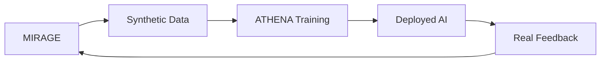

# **PROJECT OSIRIS - Product Requirements Document**

**Classification:** UNCLASSIFIED - PUBLIC  
**Version:** 1.0  
**Date:** July 2025  
**Status:** Draft - Community Review

---

## **Executive Summary**

Project OSIRIS develops the first AI platform capable of autonomous driving in chaotic emerging market environments. By combining synthetic data generation (MIRAGE) with culturally-intelligent driving AI (ATHENA), OSIRIS solves the $32B emerging market blind spot in autonomous vehicles.

**Mission**: Deploy autonomous vehicles in Lagos traffic by 2026.

---

## **Problem Statement**

### **Market Gap**
- 95% of AV training data comes from Western road conditions
- Current AV systems fail in chaotic traffic (okadas, informal infrastructure, cultural behaviors)
- $32B emerging market segment remains unserved
- Existing solutions require data center compute resources

### **Technical Challenges**
- No synthetic data for Lagos traffic scenarios
- No AI models understanding cultural traffic patterns  
- No edge-deployable solutions for resource constraints
- No frameworks for informal infrastructure navigation

---

## **Solution Overview**

### **Integrated Platform**

**MIRAGE**: Generates Lagos traffic scenarios at 1/10th industry cost  
**ATHENA**: Makes real-time driving decisions using cultural intelligence

### **Unique Value Proposition**
- First AI that understands African traffic culture
- 10x more resource-efficient than existing solutions
- Validated by local Lagos driving experts
- Deployable on single edge device vs data centers

---

## **Market Analysis**

### **Target Markets**
| Market | Size | Timeline |
|--------|------|----------|
| Lagos, Nigeria | 15M commuters | 2026 |
| African Cities | 50M+ commuters | 2027 |
| Southeast Asia | 200M+ commuters | 2028 |
| Latin America | 150M+ commuters | 2029 |

### **Customer Segments**
1. **Ride-hailing companies** (Uber, Bolt) expanding to Lagos
2. **Global AV companies** (Waymo, Cruise) seeking emerging market entry
3. **Local transportation companies** wanting autonomous capabilities
4. **Government agencies** planning smart city initiatives

---

## **Technical Requirements**

### **Performance Targets**

| Component | Metric | Target | Industry Standard |
|-----------|--------|--------|------------------|
| MIRAGE | Generation Speed | 10 scenarios/min | 1 scenario/hour |
| MIRAGE | Model Size | 500M params | 7B+ params |
| MIRAGE | Cultural Accuracy | >90% | <20% |
| ATHENA | Decision Latency | <100ms | 200-500ms |
| ATHENA | Safety Performance | 10x human | 2-3x human |
| ATHENA | Hardware | Single edge device | Data center |

### **Cultural Requirements**
- Understand Lagos traffic vocabulary ("go slow", "danfo", "okada")
- Predict behavior of 5+ vehicle types
- Navigate informal infrastructure
- Adapt to weather/cultural events

### **Deployment Requirements**
- **Hardware**: NVIDIA Jetson AGX Orin class
- **Connectivity**: 5G/4G with offline capability
- **Power**: <150W total system consumption
- **Storage**: 1TB local scenario cache

---

## **User Stories**

### **Ride-Hailing Operator**
> "As a ride-hailing operator in Lagos, I want autonomous vehicles that can navigate okada traffic and understand local driving patterns, so I can reduce driver costs while maintaining safety."

### **AV Company Executive**
> "As an AV company expanding globally, I want culturally-intelligent AI models that work in chaotic traffic, so I can deploy in emerging markets without complete system redesigns."

### **Lagos Commuter**
> "As a Lagos commuter, I want autonomous vehicles that drive like experienced local drivers, so I feel safe and arrive on time despite traffic chaos."

---

## **Feature Requirements**

### **MIRAGE Features**
- [ ] Generate 1000+ unique Lagos traffic scenarios
- [ ] Support 5+ vehicle types (cars, okadas, keke, danfos, trucks)
- [ ] Include weather scenarios (flooding, harmattan)
- [ ] Model cultural events (market days, religious processions)
- [ ] Export data in standard AV training formats

### **ATHENA Features**
- [ ] Real-time traffic pattern recognition
- [ ] Cultural behavior prediction
- [ ] Multi-modal path planning
- [ ] Emergency scenario handling
- [ ] Continuous learning from experience

### **Integration Features**
- [ ] Seamless MIRAGE→ATHENA data pipeline
- [ ] Cloud-edge hybrid deployment
- [ ] Real-time performance monitoring
- [ ] Automated model updates
- [ ] Cultural accuracy validation

---

## **Success Metrics**

### **Technical KPIs**
- **Synthetic Data Quality**: >95% human evaluator acceptance
- **Generation Efficiency**: 10x cost reduction vs competitors
- **Cultural Accuracy**: >90% local expert validation
- **Safety Performance**: 10x accident reduction vs human drivers
- **Deployment Efficiency**: Single edge device operation

### **Business KPIs**
- **Customer Acquisition**: 5+ pilot customers by Month 12
- **Revenue Growth**: $1M+ by Month 12, $10M+ by Month 18
- **Market Coverage**: 5+ cities by Month 18
- **Partnership Quality**: Major AV company partnerships

---

## **Development Timeline**

### **Phase 1: Foundation (Months 1-6)**
**Objective**: Build MIRAGE synthetic data generation

**Milestones**:
- ✅ Lagos traffic pattern analysis complete
- ✅ Cultural behavior database built
- ✅ First synthetic scenarios generated
- ✅ >80% cultural accuracy achieved
- ✅ Initial customer validation

### **Phase 2: Integration (Months 7-12)**
**Objective**: Develop ATHENA and integrate with MIRAGE

**Milestones**:
- ✅ ATHENA driving AI functional
- ✅ End-to-end pipeline working
- ✅ Lagos traffic testing complete
- ✅ Edge deployment validated
- ✅ First customer pilot launched

### **Phase 3: Scale (Months 13-18)**
**Objective**: Commercial deployment and expansion

**Milestones**:
- ✅ Multi-vehicle deployment
- ✅ Additional cities launched
- ✅ Commercial partnerships signed
- ✅ Series A funding completed
- ✅ Profitability achieved

---

## **Risk Assessment**

### **Technical Risks**
| Risk | Probability | Impact | Mitigation |
|------|-------------|--------|------------|
| Cultural accuracy insufficient | Medium | High | Local expert partnerships |
| Edge deployment performance | Low | Medium | Cloud-edge hybrid approach |
| Real-world validation challenges | Medium | High | Phased deployment strategy |

### **Market Risks**
| Risk | Probability | Impact | Mitigation |
|------|-------------|--------|------------|
| Regulatory barriers | Medium | Medium | Early government engagement |
| Competitive response | Low | Medium | First-mover advantage |
| Market readiness | Low | High | ADAS integration first |

---

## **Go-to-Market Strategy**

### **Phase 1: Proof of Concept**
- Partner with Lagos ride-hailing companies
- Demonstrate controlled environment success
- Generate local media coverage

### **Phase 2: Commercial Pilots**
- Launch paid pilot programs
- Expand to Accra, Nairobi
- Build case study library

### **Phase 3: Scale & License**
- License technology to global AV companies
- Expand to Southeast Asia, Latin America
- Establish technology partnership network

---

## **Competitive Analysis**

### **Direct Competitors**
- **Waymo**: Strong in Western markets, zero emerging market capability
- **Tesla**: Large dataset, limited cultural understanding
- **Cruise**: Advanced technology, Western-focused deployment

### **Competitive Advantages**
1. **Cultural Authenticity**: Only solution understanding African traffic
2. **Resource Efficiency**: 10x more efficient than existing solutions
3. **Local Validation**: Built with Lagos expert input
4. **Open Development**: Community-driven improvement

### **Competitive Moats**
- Cultural knowledge database (impossible to replicate quickly)
- Local partnerships and validation network
- Resource-efficient architecture
- First-mover advantage in emerging markets

---

## **Financial Projections**

### **Revenue Model**
- **Software Licensing**: $100K-$2M per customer annually
- **Data Licensing**: $50K-$500K per scenario library
- **Consulting Services**: $10K-$100K per deployment
- **Hardware Partnerships**: Revenue sharing on deployments

### **3-Year Financial Forecast**
| Year | Revenue | Customers | Market |
|------|---------|-----------|---------|
| 2026 | $1M | 5 pilots | Lagos |
| 2027 | $10M | 20 customers | 5 cities |
| 2028 | $50M | 100 customers | 15 cities |

---

## **Resource Requirements**

### **Team (Year 1)**
- Technical Lead (You): AI/ML, autonomous systems
- Senior ML Engineer: Generative models, optimization  
- Software Engineer: System architecture, deployment
- Data Engineer: Pipeline development, validation
- Cultural Consultant: Local traffic patterns
- Business Development: Customer acquisition

### **Budget (18 Months)**
- **Phase 1** (Months 1-6): $150K
- **Phase 2** (Months 7-12): $300K  
- **Phase 3** (Months 13-18): $750K
- **Total**: $1.2M

---

## **Next Steps**

### **Immediate Actions (Week 1)**
1. ✅ Set up development environment
2. ✅ Begin Lagos traffic data collection
3. ✅ Create GitHub repository with documentation
4. ✅ Start building local expert network
5. ✅ Initiate customer discovery conversations

### **30-Day Goals**
1. ✅ Complete cultural pattern analysis
2. ✅ Generate first synthetic Lagos scenario
3. ✅ Validate approach with local experts
4. ✅ Secure initial development funding
5. ✅ Establish first customer pilot interest

---

**PROJECT OSIRIS - Solving Traffic Chaos Through Cultural AI**

*"The future of autonomous driving isn't just about better sensors—it's about better understanding."*