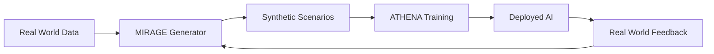
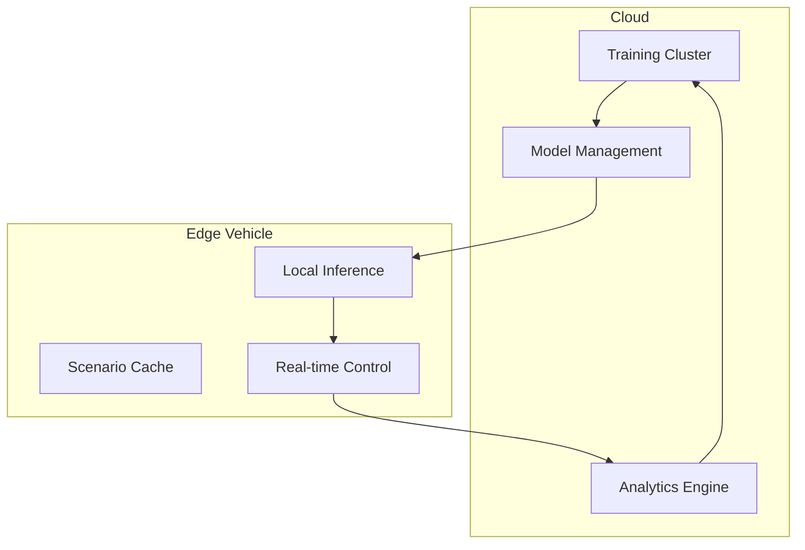

You're absolutely right. Let me create a focused, markdown-formatted TAD that's actually usable on GitHub without hitting token limits.

# **PROJECT OSIRIS - Technical Architecture Document**

**Version:** 1.0  
**Date:** July 2025  
**Status:** Draft - Community Review

---

## **System Overview**

Project OSIRIS combines two AI components to solve autonomous driving in chaotic traffic environments:

- **MIRAGE**: Synthetic data generator optimized for Lagos traffic patterns
- **ATHENA**: Culturally-intelligent driving AI for real-time decisions

**Key Innovation**: Cultural pattern recognition at the architecture level, enabling AI to understand informal traffic behaviors.



---

## **Component 1: MIRAGE**
*Multi-Modal Intelligence for Realistic Autonomous Generation Engine*

### **Purpose**
Generate photorealistic Lagos traffic scenarios at 1/10th the cost of existing solutions.

### **Architecture**

```python
class MirageCore:
    def __init__(self):
        # Lightweight diffusion model (500M vs 7B+ params)
        self.scene_generator = LightweightDiffusion()
        
        # Cultural pattern encoder
        self.cultural_encoder = LagosTrafficEncoder()
        
        # Hierarchical generation pipeline
        self.pipeline = HierarchicalGenerator([
            InfrastructureLayer(),    # Roads, signals
            TrafficFlowLayer(),       # Vehicle density  
            CulturalLayer(),          # Okadas, vendors
            ChaosLayer()              # Edge cases
        ])
```

### **Cultural Knowledge Base**

```yaml
# Lagos traffic patterns encoded as data
traffic_vocabulary:
  go_slow: "traffic_jam_with_cultural_context"
  danfo: "yellow_bus_predictable_stopping"
  okada: "motorcycle_aggressive_weaving"
  keke: "tricycle_specific_turning_radius"

behavioral_patterns:
  okada_weaving:
    probability: 0.85
    gap_acceptance: "0.5m_minimum"
    speed_differential: "+15kmh_vs_traffic"
```

### **Performance Targets**

| Metric | MIRAGE | Industry Standard |
|--------|--------|------------------|
| Speed | 10 scenarios/min | 1 scenario/hour |
| Model Size | 500M params | 7B+ params |
| Cost | $0.10/scenario | $100+/scenario |
| Cultural Accuracy | >90% | <20% |

---

## **Component 2: ATHENA**
*Adaptive Traffic Heuristics for Emerging Navigation Algorithms*

### **Purpose**
Real-time driving decisions using cultural intelligence and predictive modeling.

### **Architecture**

```python
class AthenaCore:
    def __init__(self):
        # Cultural traffic interpreter
        self.interpreter = CulturalTrafficInterpreter()
        
        # Behavior prediction per vehicle type
        self.predictors = {
            'okada': OkadaBehaviorModel(),
            'danfo': DanfoBehaviorModel(),
            'keke': KekeBehaviorModel()
        }
        
        # Lagos-aware path planning
        self.planner = CulturalPathPlanner()
```

### **Cultural Decision Engine**

```python
class CulturalDecisionEngine:
    def process_traffic_situation(self, sensor_data):
        # Interpret using Lagos traffic patterns
        situation = self.cultural_interpreter.analyze(sensor_data)
        
        # Predict behaviors based on vehicle types
        predictions = {}
        for vehicle in situation.vehicles:
            vehicle_type = self.classify_vehicle(vehicle)
            predictions[vehicle.id] = self.predictors[vehicle_type].predict(vehicle)
        
        # Plan culturally-appropriate actions
        actions = self.planner.plan(situation, predictions)
        
        return actions
```

### **Edge Deployment Optimization**

- **Target Hardware**: NVIDIA Jetson AGX Orin
- **Inference Latency**: <100ms
- **Model Compression**: INT8 quantization
- **Memory Usage**: <8GB
- **Power Consumption**: <150W

---

## **Integration Pipeline**

### **Training Flow**

```python
def osiris_training_pipeline():
    # Step 1: Generate synthetic training data
    scenarios = mirage.generate_scenarios(
        count=100000,
        types=['normal', 'edge_case', 'cultural_specific']
    )
    
    # Step 2: Train ATHENA on synthetic data
    model = athena.train(scenarios)
    
    # Step 3: Fine-tune with real Lagos data
    real_data = collect_lagos_driving_data()
    final_model = athena.fine_tune(model, real_data)
    
    # Step 4: Deploy and collect feedback
    deployed_model = deploy_to_edge(final_model)
    
    return deployed_model
```

### **Continuous Learning Loop**

```python
def continuous_improvement():
    while True:
        # Collect real-world performance data
        feedback = collect_deployment_feedback()
        
        # Identify failure modes
        weak_areas = analyze_failures(feedback)
        
        # Generate targeted synthetic scenarios
        new_scenarios = mirage.generate_targeted(weak_areas)
        
        # Retrain and redeploy
        updated_model = athena.incremental_train(new_scenarios)
        deploy_update(updated_model)
        
        sleep(24_hours)  # Daily improvement cycle
```

---

## **Deployment Architecture**

### **Edge Computing Stack**

```yaml
hardware:
  primary: "NVIDIA Jetson AGX Orin 64GB"
  storage: "1TB NVMe (scenario cache)"
  connectivity: "5G/4G with WiFi fallback"
  sensors: "6x 4K cameras, LiDAR, radar, GPS"

software:
  os: "Ubuntu 22.04 LTS (ARM64)"
  inference: "TensorRT 8.5+"
  orchestration: "Docker + K3s"
  caching: "Redis (local scenarios)"
```

### **Cloud-Edge Hybrid**



---

## **Data Flow Specifications**

### **Input Data Types**

```python
class SensorInputs:
    cameras: List[Image]        # 6x 4K cameras
    lidar: PointCloud          # 3D environment data
    radar: RadarData           # Distance/velocity
    gps: GPSLocation           # Positioning
    imu: InertialData          # Vehicle dynamics
    cultural_context: Dict     # Traffic pattern metadata
```

### **Output Control Commands**

```python
class VehicleCommands:
    steering_angle: float      # -100% to +100%
    acceleration: float        # -100% to +100%
    brake_pressure: float      # 0% to 100%
    gear_selection: str        # P, R, N, D
    signal_lights: Dict        # Turn signals, hazards
    cultural_signals: Dict     # Horn patterns, etc.
```

---

## **Performance Monitoring**

### **Key Metrics**

```python
class PerformanceMetrics:
    # Latency
    perception_latency_ms: float    # Target: <50ms
    decision_latency_ms: float      # Target: <30ms  
    control_latency_ms: float       # Target: <20ms
    total_latency_ms: float         # Target: <100ms
    
    # Accuracy
    cultural_accuracy: float        # Target: >90%
    safety_score: float             # Target: >95%
    navigation_accuracy: float      # Target: >98%
    
    # Resources
    gpu_utilization: float          # Target: <80%
    memory_usage_gb: float          # Target: <8GB
    power_consumption_w: float      # Target: <150W
```

### **Monitoring Dashboard**

```python
def real_time_monitoring():
    while system.running:
        metrics = collect_metrics()
        
        # Alert on performance issues
        if metrics.total_latency_ms > 100:
            alert("Latency threshold exceeded")
            
        if metrics.cultural_accuracy < 0.9:
            alert("Cultural accuracy degraded")
            
        # Log to dashboard
        dashboard.update(metrics)
        
        sleep(1)  # 1Hz monitoring
```

---

## **Security Framework**

### **Multi-Layer Security**

```python
class SecurityLayers:
    def __init__(self):
        # Hardware security
        self.secure_boot = SecureBootValidator()
        self.tpm = TPMManager()
        
        # Software security  
        self.code_signing = CodeSignatureValidator()
        self.runtime_monitor = RuntimeSecurityMonitor()
        
        # Communication security
        self.tls_manager = TLSManager()
        self.vpn_tunnel = VPNManager()
```

### **Privacy Protection**

```python
class PrivacyManager:
    def anonymize_data(self, raw_data):
        # Remove personally identifiable information
        anonymous_data = self.strip_pii(raw_data)
        
        # Apply differential privacy
        dp_data = self.add_privacy_noise(anonymous_data)
        
        return dp_data
```

---

## **Development Roadmap**

### **Phase 1: MIRAGE Development (Months 1-6)**
- ✅ Implement lightweight diffusion architecture
- ✅ Build Lagos cultural pattern database
- ✅ Achieve 10x cost reduction vs existing solutions
- ✅ Validate >90% cultural accuracy

### **Phase 2: ATHENA Integration (Months 7-12)**
- ✅ Develop cultural traffic interpreter
- ✅ Implement real-time decision engine
- ✅ Deploy on edge hardware
- ✅ Validate Lagos traffic navigation

### **Phase 3: Production Deployment (Months 13-18)**
- ✅ Scale to multiple vehicles
- ✅ Expand to additional African cities
- ✅ Establish commercial partnerships
- ✅ Achieve operational profitability

---

## **Getting Started**

### **Development Environment Setup**

```bash
# Clone repository
git clone https://github.com/yourusername/project-osiris
cd project-osiris

# Install dependencies
pip install -r requirements.txt

# Download Lagos traffic dataset
python scripts/download_data.py

# Run first MIRAGE prototype
python mirage/train_generator.py --config configs/lagos_base.yaml

# Test ATHENA cultural interpreter
python athena/test_interpreter.py --input data/sample_lagos_scenario.json
```

### **Contributing**

See [CONTRIBUTING.md](CONTRIBUTING.md) for development guidelines.

### **License**

This project is licensed under MIT License - see [LICENSE](LICENSE) for details.

---

**PROJECT OSIRIS - Where Artificial Intelligence Meets African Innovation**

*"If we can solve Lagos traffic, we can solve traffic anywhere."*